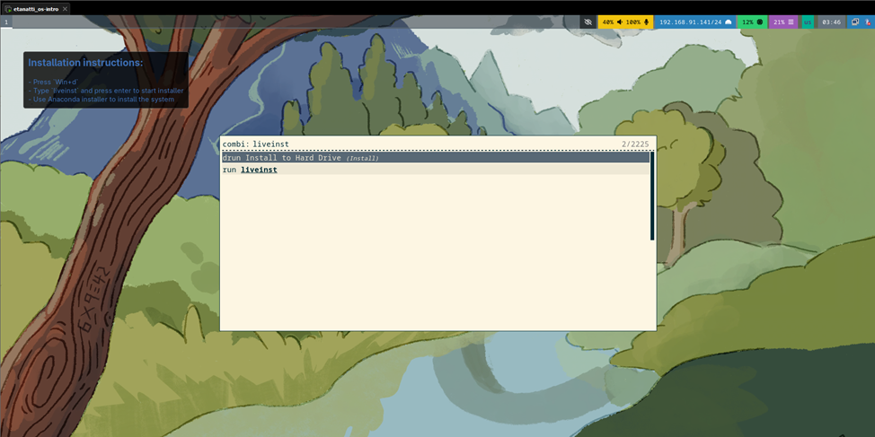
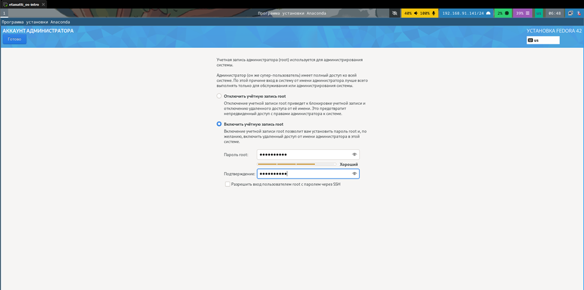
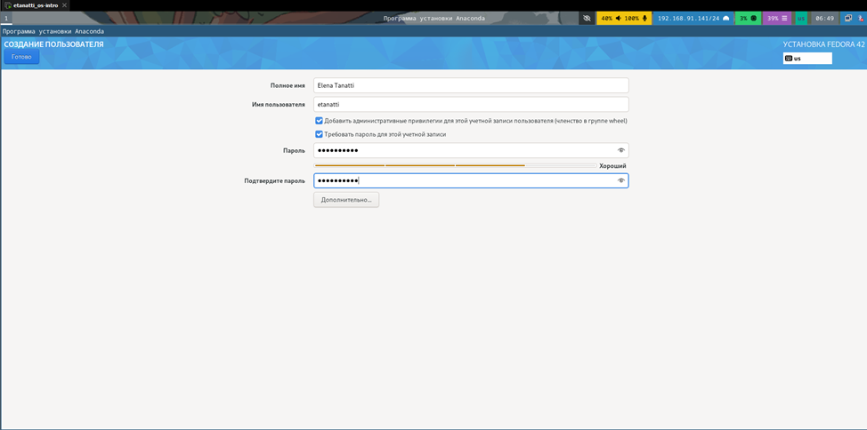
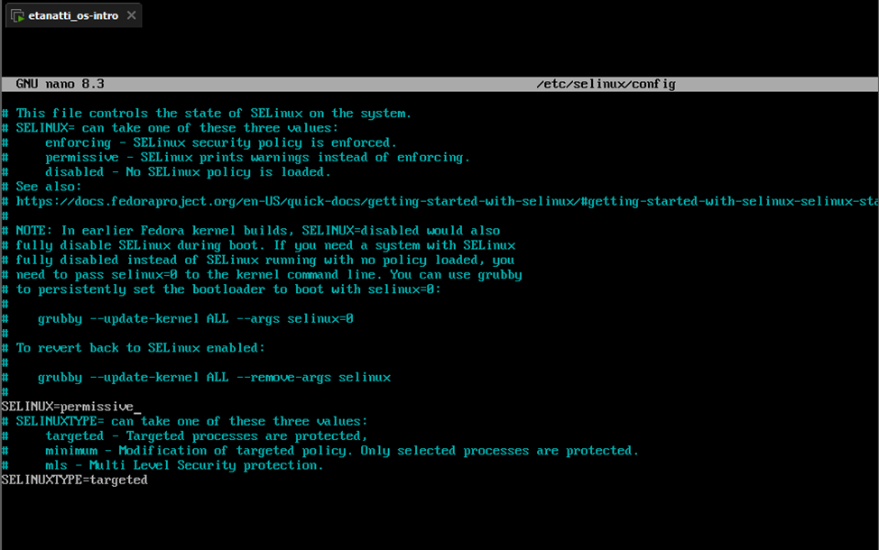
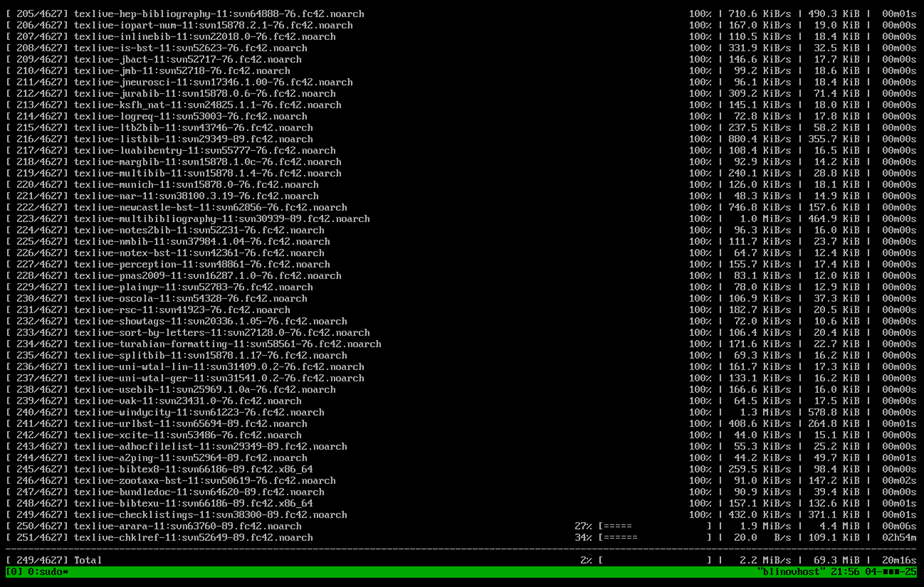
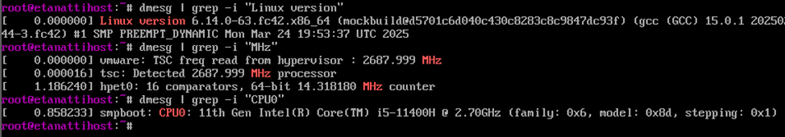
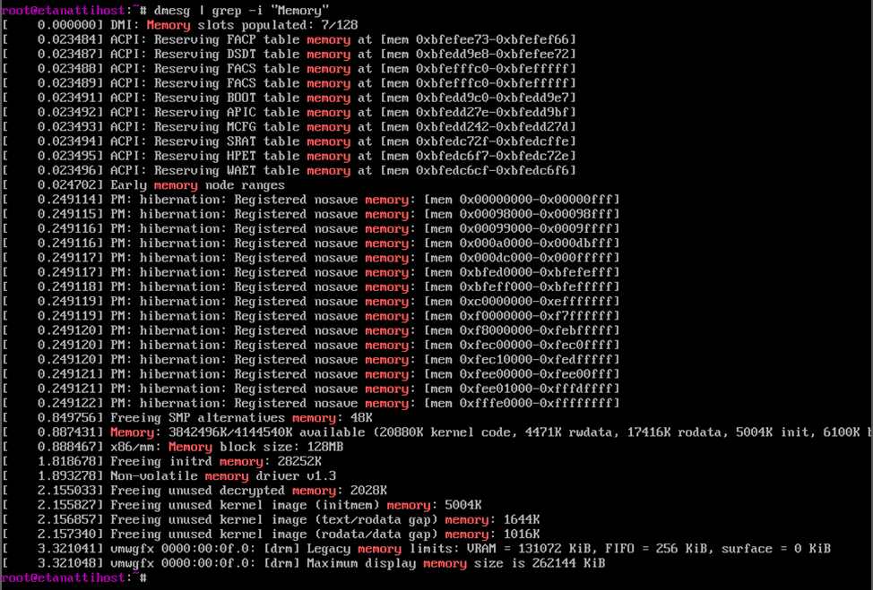
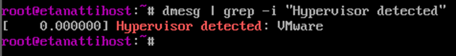
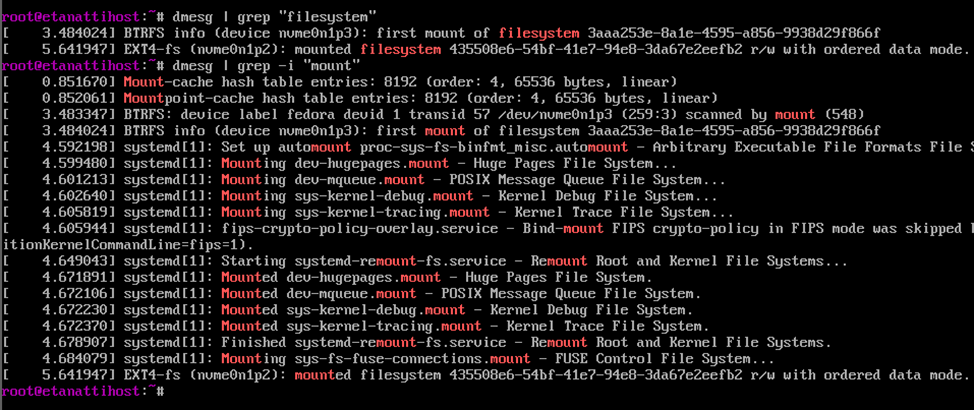

# Лабораторная работа №1

## 1. Установка системы 


## 2. Создание пользователя root


## 3. Создание пользователя


## 4. Отключение SELinux


## 5. Установка дистрибутива textlive


# Домашнее задание

## 1. Версия ядра Linux (Linux version)
## 2. Частота процессора (Detected Mhz processor)
## 3. Модель процессора (CPU0)


## 4. Объём доступной оперативной памяти (Memory available)


## 5. Тип обнаруженного гипервизора (Hypervisor detected)


## 6. Тип файловой системы корневого раздела
## 7. Последовательность монтирования файловых систем.


# Контрольные вопросы

### 1. Какую информацию содержит учётная запись пользователя?

Учётная запись хранит:

- Имя пользователя (login) – уникальное имя для входа.
- UID (User ID) – числовой идентификатор пользователя.
- GID (Group ID) – идентификатор основной группы.
- Домашний каталог – папка, где хранятся личные файлы пользователя.
- Командная оболочка (shell) – программа, которая запускается после входа (обычно /bin/bash).
- Пароль (хранится в зашифрованном виде).

Вся эта информация обычно хранится в файлах:
- `/etc/passwd` – базовые данные о пользователях.
- `/etc/shadow` – пароли и их параметры.
- `/etc/group` – данные о группах.


### 2. Укажите команды терминала и приведите примеры:

- для получения справки по команде;
`man ls`        # откроет руководство по команде ls
`ls --help`     # краткая справка
- для перемещения по файловой системе;
`cd /home`      # перейти в каталог /home
`cd ..`         # на уровень выше
`cd ~`          # в домашний каталог
- для просмотра содержимого каталога;
`ls`            # список файлов
`ls -l`         # подробный список (права, размер, дата)
`ls -a`         # показать скрытые файлы
- для определения объёма каталога;
`du -sh /home`      # размер каталога /home
`du -sh *`          # размеры всех подпапок
- для создания / удаления каталогов / файлов;
`mkdir new_dir`     # создать папку
`rmdir old_dir`     # удалить пустую папку
`rm -r dir_name`    # удалить папку с содержимым
`touch file.txt`    # создать пустой файл
`rm file.txt`       # удалить файл
- для задания определённых прав на файл / каталог;
`chmod 755 script.sh`   # права rwxr-xr-x
`chmod 644 file.txt`    # права rw-r--r--
`chown user:group file` # смена владельца и группы
- для просмотра истории команд.
`history`      # список всех команд
`!15`          # повторить команду под номером 15

### 3. Что такое файловая система? Приведите примеры с краткой характеристикой.

Файловая система – это способ организации и хранения данных на диске. Она определяет, как файлы записываются, читаются и управляются.

Примеры:
- ext4 – самая распространённая в Linux, поддерживает большие файлы, журналирование.
- XFS – высокопроизводительная, подходит для серверов с большими объёмами данных.
- Btrfs – современная, с поддержкой снапшотов и сжатия.
- FAT32 / exFAT – часто используется для флешек, совместима с Windows и Linux.
- NTFS – основная файловая система Windows, в Linux поддерживается через драйвер ntfs-3g.

### 4. Как посмотреть, какие файловые системы подмонтированы в ОС?

```
mount | column -t     # показать список смонтированных ФС
df -h                 # показать диски и их использование
lsblk -f              # список устройств с файловыми системами
cat /etc/mtab         # список текущих монтирований
```

### 5. Как удалить зависший процесс?

- Найти процесс:
```
ps aux | grep имя_процесса
top         # интерактивный просмотр
htop        # удобный аналог top (если установлен)
```
- Убить процесс
```
kill PID          # отправить сигнал завершения (PID = номер процесса)
kill -9 PID       # принудительное завершение
```
