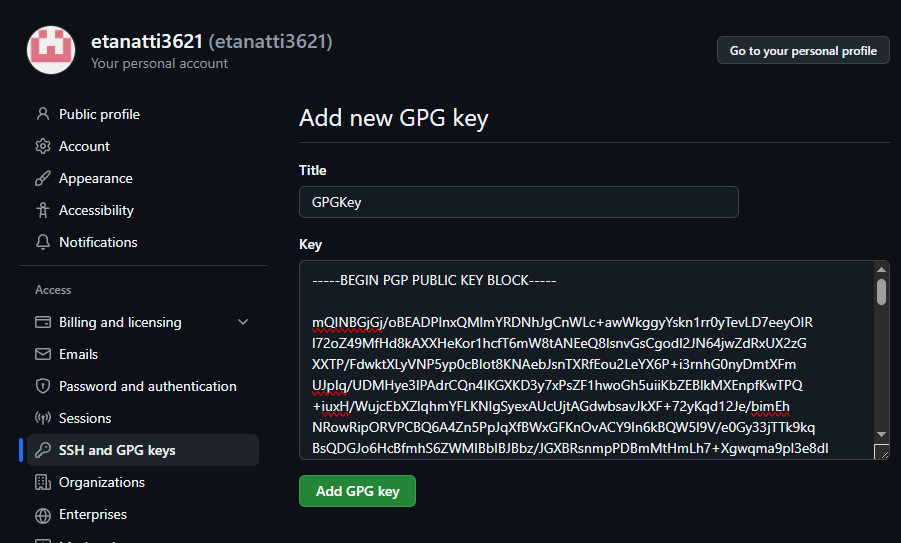
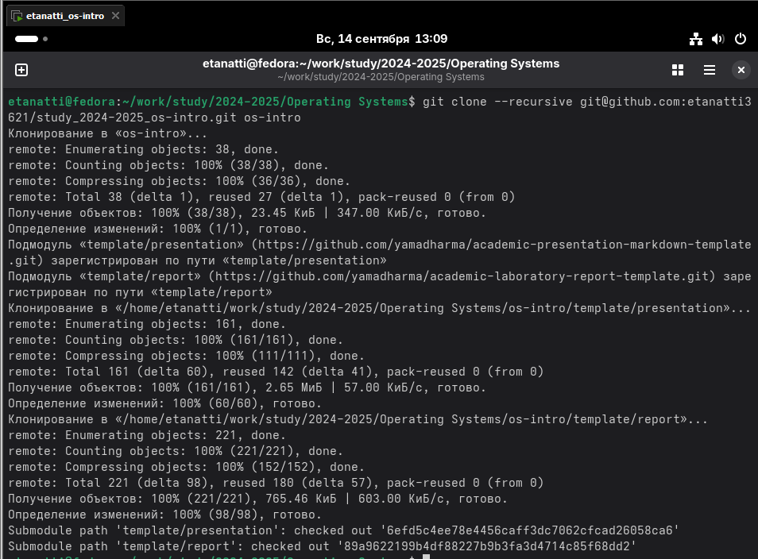
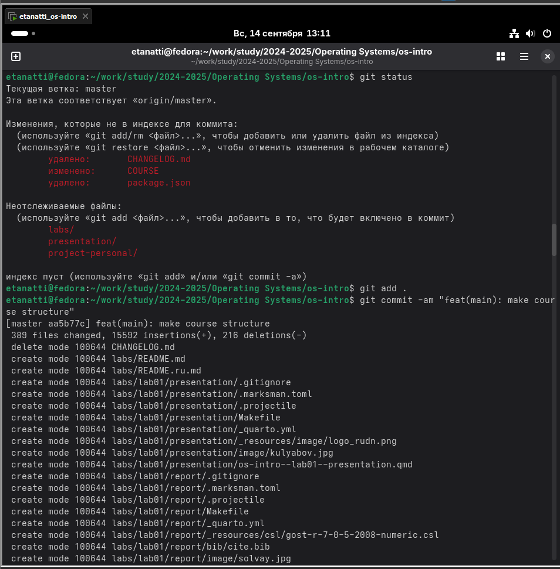
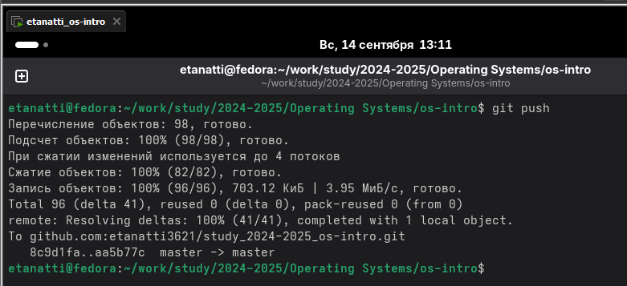

# Лабораторная работа №3

## 1. Установка гит


## 1. Настройка гит


## 2. Создание ключей ssh


## 3. Добавление PGP ключа на GitHub




## 4. Настройка автоматических подписей коммитов git


## 5. Настройка gh


## 6. Создание репозитория курса на основе шаблона




## 7. Настройка каталога курса



## 8. Отправка файлов на сервер


# Контрольные вопросы

### 1. Что такое системы контроля версий (VCS) и для решения каких задач они предназначаются?

VCS — системы для отслеживания изменений в файлах. Задачи: хранение истории, откат изменений, командная работа, слияние кода.

### 2. Объясните следующие понятия VCS и их отношения: хранилище, commit, история, рабочая копия.

- Хранилище (репозиторий) — база данных, хранящая файлы и их историю.
- Коммит (commit) — снимок состояния файлов на определенный момент времени.
- История — последовательность коммитов.
- Рабочая копия — текущие файлы на рабочем компьютере.
- Отношения: В рабочей копии вносят изменения, которые затем фиксируют в истории репозитория в виде коммитов.

### 3. Что представляют собой и чем отличаются централизованные и децентрализованные VCS? Приведите примеры VCS каждого вида.

- Централизованные (CVCS): Одно главное хранилище на сервере (пример: SVN, TFS).
- Децентрализованные (DVCS): У каждого разработчика есть полная копия хранилища (пример: Git, Mercurial).

### 4. Опишите действия с VCS при единоличной работе с хранилищем.

`git init`, вносить изменения, `git add`, `git commit`. Периодически просматривать историю (`git log`).

### 5. Опишите порядок работы с общим хранилищем VCS.

`git clone`, затем цикл: `git pull` -> внести изменения -> `git add` -> `git commit` -> `git push`.

### 6. Каковы основные задачи, решаемые инструментальным средством git?

Основные задачи Git: распределенное управление версиями, ветвление, слияние, отслеживание истории.

### 7. Назовите и дайте краткую характеристику командам git.

- `init` — создать репозиторий.
- `clone` — скопировать удаленный репозиторий.
- `add` — добавить файлы к следующему коммиту.
- `commit` — зафиксировать изменения.
- `push` — отправить коммиты на удаленный сервер.
- `pull` — забрать обновления с сервера.
- `checkout`/`switch` — переключиться на ветку или коммит.
- `branch` — управление ветками.
- `merge` — объединить ветки.

### 8. Приведите примеры использования при работе с локальным и удалённым репозиториями.

- Локальный: ```git init && git add . && git commit -m "First commit"```
- Удаленный: ```git clone <url>... внести изменения... git push origin main```

### 9. Что такое и зачем могут быть нужны ветви (branches)?

Ветви (branches) нужны для изоляции функциональности (например, новая фича или исправление бага) без влияния на основной код.

### 10. Как и зачем можно игнорировать некоторые файлы при commit?

Чтобы не добавлять в репозиторий служебные файлы (логи, бинарники, настройки IDE). Для этого создается файл .gitignore, где перечисляются шаблоны игнорируемых файлов.