# Лабораторная работа №4

## 1. Определите полное имя вашего домашнего каталога. Далее относительно этого каталога будут выполняться последующие упражнения.
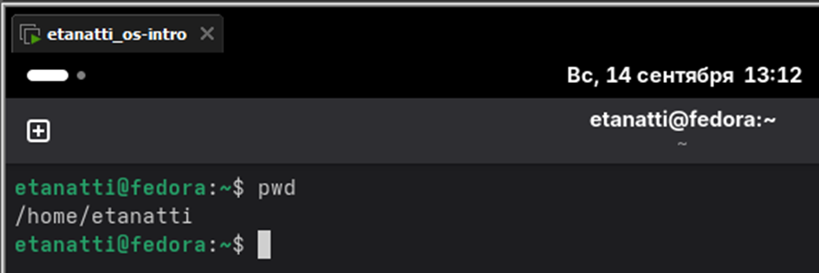

## 2. Выполните следующие действия:
## 2.1 Перейти в каталог /tmp
## 2.2 Вывести на экран содержимое каталога /tmp
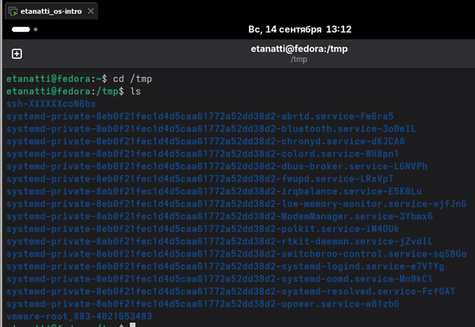

`ls` Вывод: Покажет только имена файлов и каталогов.
`ls -l` Вывод: Покажет подробную информацию, включая права доступа, владельца, группу, размер и дату изменения. Ключ `-l` означает "long format".
`ls -a` Вывод: Покажет все файлы, включая скрытые (те, которые начинаются с точки .). Ключ `-a` означает "all".
`ls -la` Вывод: Объединяет вывод двух предыдущих команд. Это самый информативный вариант.
Пояснение разницы: Опция `-l` дает больше информации о каждом объекте, а `-a` показывает объекты, которые не видно при простом вызове `ls`.


## 2.3 Определить есть ли в каталоге /var/spool подкаталог с именем cron
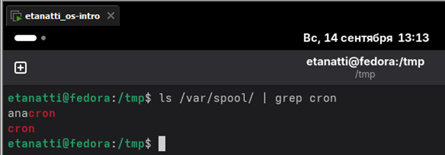

## 2.4 Перейти в домашний каталог и вывести на экран его содержимое, определить владельца файлов и подкаталогов
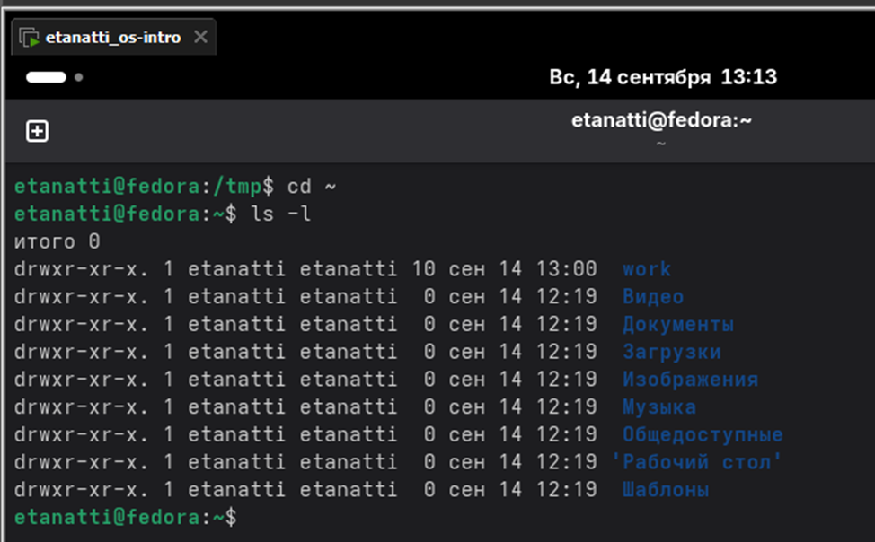

## 3.
## 3.1 В домашнем каталоге создать новый каталог с именем newdir
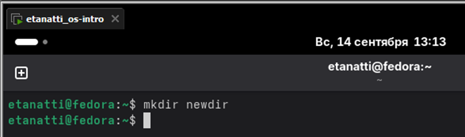

## 3.2 В каталоге newdir создать новый каталог с именем morefun
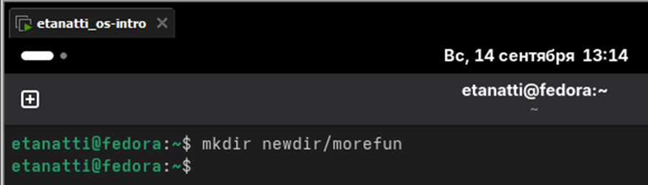

## 3.3 В домашнем каталоге создать одной командой три новых каталога и затем удалить их
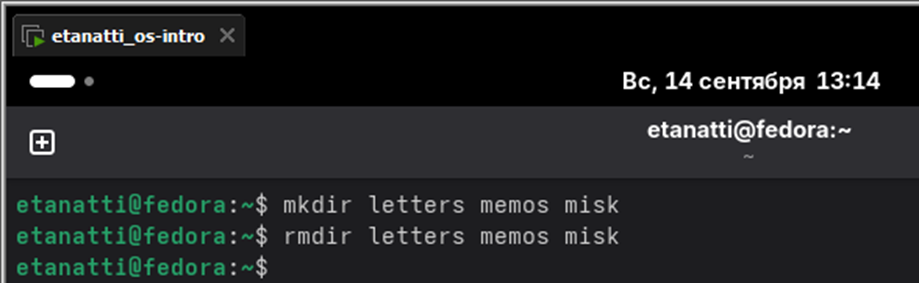

## 3.4 Удалить каталог newdir командой rm
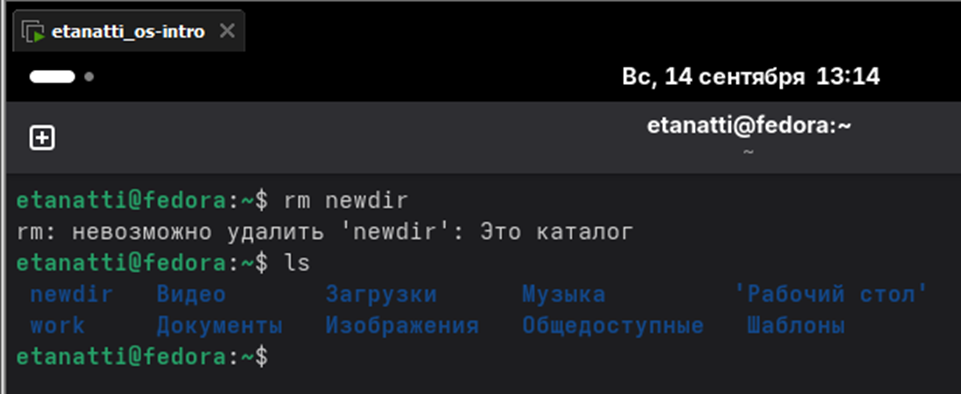

## 3.5 Удалить каталог newdir/morefun из домашнего каталога и проверить удаление
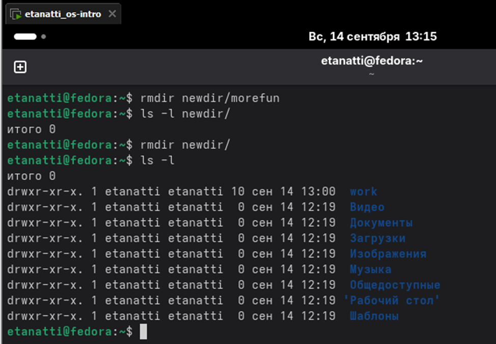

## 4. С помощью команды man определить опцию ls для просмотра содержимого не только указанного каталога, но и подкаталогов, входящих в него
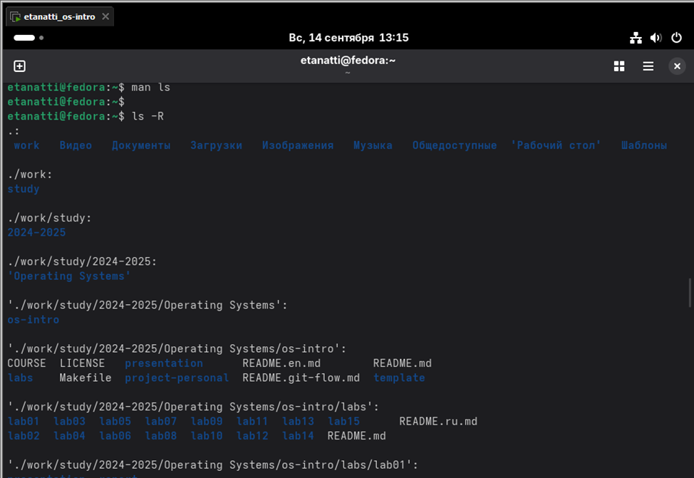

## 5. С помощью команды man определите набор опций команды ls, позволяющий отсортировать по времени последнего изменения выводимый список содержимого каталога с развёрнутым описанием файлов.
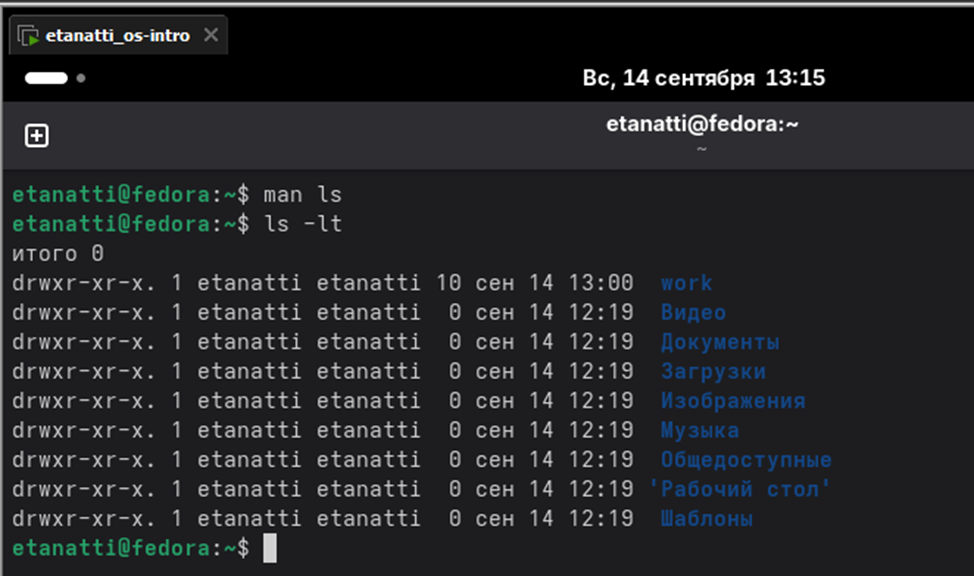

## 6. Используйте команду man для просмотра описания следующих команд: cd, pwd, mkdir, rmdir, rm. Поясните основные опции этих команд
- cd:
    - cd - : Перейти в предыдущий рабочий каталог.
    - cd ~ : Перейти в домашний каталог.
- pwd:
    - -P : Показать физическое расположение (без символических ссылок).
    - -L : Показать логический путь (с учетом символических ссылок, используется по умолчанию).
- mkdir:
    - -p : Создать все несуществующие родительские каталоги по указанному пути.
    - -v : Выводить сообщение о каждом создаваемом каталоге.
- rmdir:
    - Удаляет только пустые каталоги.
    - -p : Удалить каталог и его пустые родительские каталоги.
    - -v : Выводить информацию о процессе.
- rm:
    - -i : Интерактивный режим (запрос подтверждения перед удалением).
    - -r или -R : Рекурсивное удаление (для каталогов и их содержимого).
    - -f : Принудительное удаление без запросов и ошибок.
    - -v : Выводить информацию об удаляемом файле.

## 7. Используя информацию, полученную при помощи команды history, выполните модификацию и исполнение нескольких команд из буфера команд
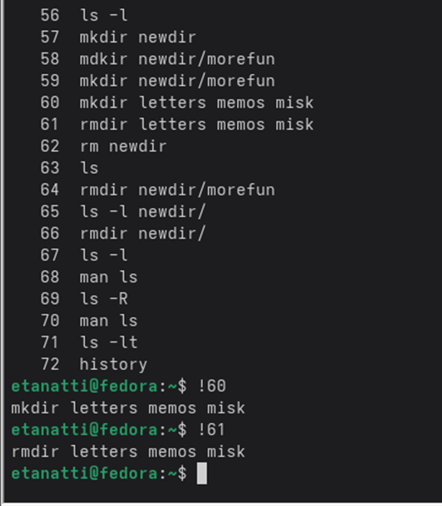

# Контрольные вопросы

### 1. Что такое командная строка?

Командная строка — текстовый интерфейс для взаимодействия с ОС, где команды вводятся вручную (например, оболочка Bash).

### 2. При помощи какой команды можно определить абсолютный путь текущего каталога? Приведите пример.

```
$ pwd
/home/username
```

### 3. При помощи какой команды и каких опций можно определить только тип файлов и их имена в текущем каталоге? Приведите примеры.

```
ls -F (добавляет символы для указания типа: / для каталогов, * для исполняемых файлов)
$ ls -F
file.txt  script.sh*  directory/
```

### 4. Каким образом отобразить информацию о скрытых файлах? Приведите примеры.

```
ls -a (показывает скрытые файлы, начинающиеся с точки)
$ ls -a
.  ..  .hidden_file  normal_file
```

### 5. При помощи каких команд можно удалить файл и каталог? Можно ли это сделать одной и той же командой? Приведите примеры.

Удалить файл: rm, каталог: rm -r или rmdir (для пустых).
Да, можно одной командой: rm -r для каталогов и файлов.

```
rm file.txt          # удалить файл
rm -r mydir          # удалить каталог рекурсивно
rmdir emptydir       # удалить пустой каталог
```

### 6. Каким образом можно вывести информацию о последних выполненных пользователем командах? работы?

`history` — показывает историю выполненных команд.

### 7. Как воспользоваться историей команд для их модифицированного выполнения? Приведите примеры.

Используйте !<номер_команды> или !<начало_команды>.
```
!55                # выполнить команду под номером 55 из history
!ls                # выполнить последнюю команду, начинающуюся с "ls"
```

### 8. Приведите примеры запуска нескольких команд в одной строке.

```
command1 ; command2          # выполнить последовательно
command1 && command2         # выполнить command2 только при успехе command1
command1 || command2         # выполнить command2 только при ошибке command1
```
### 9. Дайте определение и приведите примера символов экранирования.

Экранирование — защита специальных символов (например, \, ', ").
```
echo "File name: \"file.txt\""   # вывод: File name: "file.txt"
```

### 10. Охарактеризуйте вывод информации на экран после выполнения команды ls с опцией

ls -l выводит список файлов с деталями: права доступа, количество ссылок, владелец, группа, размер, дата изменения, имя.

### 11. Что такое относительный путь к файлу? Приведите примеры использования относительного и абсолютного пути при выполнении какой-либо команды.

Относительный путь — путь относительно текущего каталога.
```
cat ./file.txt          # относительный путь
cat /home/user/file.txt # абсолютный путь
```
### 12. Как получить информацию об интересующей вас команде?

```
man <команда> (руководство) или <команда> --help (краткая справка).
man ls
ls --help
```

### 13. Какая клавиша или комбинация клавиш служит для автоматического дополнения вводимых команд?

`Tab` — автоматическое дополнение команд, путей или имён файлов.