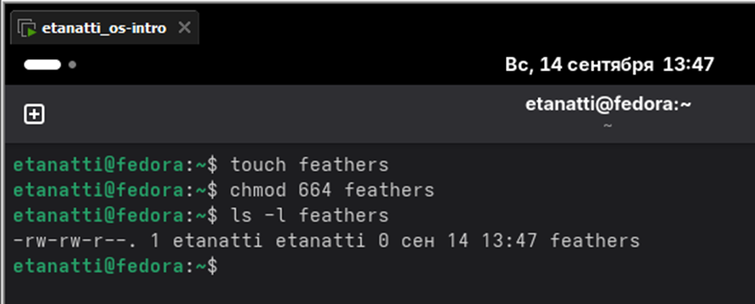

# Лабораторная работа №5

## 5.2.1 Команды для работы с файлами и каталогами


## 5.2.2 Копирование файлов и каталогов


## 5.2.3 Перемещение и переименование файлов и каталогов


## 5.2.5 Изменение прав доступа


## 5.2.6 Анализ файловой системы


## 5.3 Последовательность выполнения работы
## 2.
## 2.1 Скопируйте файл /usr/include/sys/io.h в домашний каталог и назовите егоequipment. Если файла io.h нет, то используйте любой другой файл в каталоге /usr/include/sys/ вместо него.


## 2.2 В домашнем каталоге создайте директорию ~/ski.plases


## 2.3 Переместите файл equipment в каталог ~/ski.plases


## 2.4 Переименуйте файл ~/ski.plases/equipment в ~/ski.plases/equiplist


## 2.5 Создайте в домашнем каталоге файл abc1 и скопируйте его в каталог ~/ski.plases, назовите его equiplist2


## 2.6 Создайте каталог с именем equipment в каталоге ~/ski.plases


## 2.7 Переместите файлы ~/ski.plases/equiplist и equiplist2 в каталог ~/ski.plases/equipment


## 2.8 Создайте и переместите каталог ~/newdir в каталог ~/ski.plases и назовите его plans


## 3. Определите опции команды chmod, необходимые для того, чтобы присвоить перечисленным ниже файлам выделенные права доступа, считая, что в начале таких прав нет:
## 3.1 drwxr--r-- ... australia


## 3.2 drwx--x--x ... play


## 3.3 -r-xr--r-- ... my_os


## 3.4 -rw-rw-r-- ... feathers


## 4. Проделайте приведённые ниже упражнения, записывая в отчёт по лабораторной работе используемые при этом команды
## 4.1 Просмотрите содержимое файла /etc/password


## 4.2 Скопируйте файл ~/feathers в файл ~/file.old


## 4.3 Переместите файл ~/file.old в каталог ~/play


## 4.4 Скопируйте каталог ~/play в каталог ~/fun


## 4.5 Переместите каталог ~/fun в каталог ~/play и назовите его games


## 4.6 Лишите владельца файла ~/feathers права на чтение


## 4.7 Что произойдёт, если вы попытаетесь просмотреть файл ~/feathers командой cat?


## 4.8 Что произойдёт, если вы попытаетесь скопировать файл ~/feathers?


## 4.9 Дайте владельцу файла ~/feathers право на чтение


## 4.10 Лишите владельца каталога ~/play права на выполнение


## 4.11 Перейдите в каталог ~/play. Что произошло?


## 4.12 Дайте владельцу каталога ~/play право на выполнение


## 5. Прочитайте man по командам mount, fsck, mkfs, kill и кратко их охарактеризуйте, приведя примеры.
1. mount
Назначение: Монтирование файловых систем (ФС) в дерево каталогов.
Пример:
```
# Монтирование USB-флешки (предполагая, что устройство /dev/sdb1)
```
sudo mount /dev/sdb1 /mnt/usb
2. fsck
Назначение: Проверка и восстановление целостности ФС.
Пример:
```
# Проверка ФС на разделе /dev/sda1
sudo fsck /dev/sda1
```
3. mkfs
Назначение: Создание новой ФС на разделе (форматирование).
Пример:
```
# Создание ФС ext4 на разделе /dev/sdb1
sudo mkfs.ext4 /dev/sdb1
```
4. kill
Назначение: Отправка сигналов процессам (например, для завершения).
Пример:
```
# Корректное завершение процесса с PID 1234
kill 1234
# Принудительное завершение
kill -9 1234
```

# Контрольные вопросы

### 1. Дайте характеристику каждой файловой системе, существующей на жёстком диске компьютера, на котором вы выполняли лабораторную работу.

ext4 (основная, журналируемая), XFS (для больших данных), vfat (FAT32, для EFI-раздела), swap (файл подкачки).

### 2. Приведите общую структуру файловой системы и дайте характеристику каждой директории первого уровня этой структуры.

- /bin - основные бинарные файлы
- /etc - конфигурационные файлы
- /home - домашние директории пользователей
- /var - изменяемые файлы (логи, кэш)
- /usr - пользовательские приложения
- /boot - файлы загрузки
- /tmp - временные файлы


### 3. Какая операция должна быть выполнена, чтобы содержимое некоторой файловой системы было доступно операционной системе?

Монтирование: mount /dev/раздел /точка/монтирования

### 4. Назовите основные причины нарушения целостности файловой системы. Как устранить повреждения файловой системы?

Причины: сбои питания, ошибки оборудования. Устранение: fsck /dev/раздел

### 5. Как создаётся файловая система?

mkfs -t тип_фс /dev/раздел (например: mkfs.ext4 /dev/sdb1)

### 6. Дайте характеристику командам для просмотра текстовых файлов.

- cat - вывод всего файла
- less/more - постраничный просмотр
- head/tail - начало/конец файла

### 7. Приведите основные возможности команды cp в Linux

- Копирование файлов/директорий (-r)
- Сохранение атрибутов (-a)
- Интерактивный режим (-i)

### 8. Приведите основные возможности команды mv в Linux.

- Перемещение файлов
- Переименование
- Перезапись (если нет подтверждения)

### 9. Что такое права доступа? Как они могут быть изменены?

Права доступа: rwx (read/write/execute) для user/group/others. Изменение: chmod, chown, chgrp
