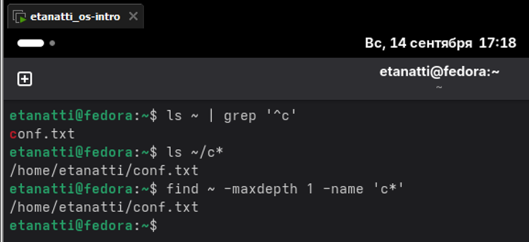
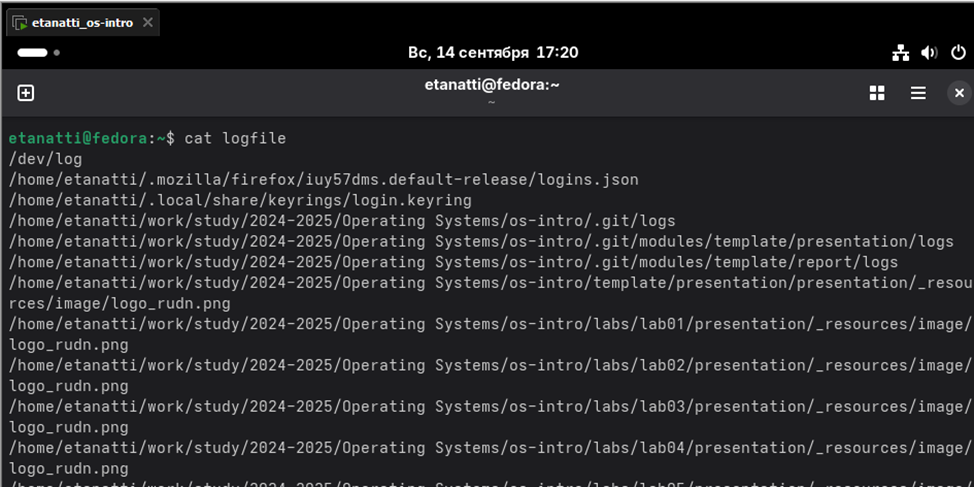

# Лабораторная работа №6

## 2. Запишите в файл file.txt названия файлов, содержащихся в каталоге /etc. Допишите в этот же файл названия файлов, содержащихся в вашем домашнем каталоге

## 3. Выведите имена всех файлов из file.txt, имеющих расширение .conf, после чего запишите их в новый текстовой файл conf.txt

## 4. Определите, какие файлы в вашем домашнем каталоге имеют имена, начинавшиеся с символа c? Предложите несколько вариантов, как это сделать

## 5. Выведите на экран (по странично) имена файлов из каталога /etc, начинающиеся с символа h.

## 6. Запустите в фоновом режиме процесс, который будет записывать в файл ~/logfile файлы, имена которых начинаются с log

## 7. Удалите файл ~/logfile

## 8. Запустите из консоли в фоновом режиме редактор gedit

## 9. Определите идентификатор процесса gedit, используя команду ps, конвейер и фильтр grep. Как ещё можно определить идентификатор процесса?

## 10. Прочтите справку (man) команды kill, после чего используйте её для завершения процесса gedit

## 11. Выполните команды df и du, предварительно получив более подробную информацию об этих командах, с помощью команды man

## 12. Воспользовавшись справкой команды find, выведите имена всех директорий, имеющихся в вашем домашнем каталоге

# Контрольные вопросы

### 1. Какие потоки ввода вывода вы знаете?

stdin (0), stdout (1), stderr (2)

### 2. Объясните разницу между операцией > и >>.

перезаписывает файл, >> добавляет в конец

### 3. Что такое конвейер?

Конвейер (|) — перенаправление вывода одной команды на вход другой

### 4. Что такое процесс? Чем это понятие отличается от программы?

Процесс — экземпляр выполняющейся программы в памяти. Программа — статичный файл на диске.

### 5. Что такое PID и GID?

PID — уникальный идентификатор процесса. GID — идентификатор группы процессов.

### 6. Что такое задачи и какая команда позволяет ими управлять?

Задачи — процессы в рамках сессии shell. Управление: jobs, fg, bg, kill %n

### 7. Найдите информацию об утилитах top и htop. Каковы их функции?

top и htop — мониторы процессов. htop — улучшенная версия с навигацией и цветным выводом.

### 8. Назовите и дайте характеристику команде поиска файлов. Приведите примеры использования этой команды.

find — поиск файлов. Пример: find ~ -name "*.txt" -type f

### 9. Можно ли по контексту (содержанию) найти файл? Если да, то как?

Да, через grep: grep -r "текст" /путь/ или find /путь/ -type f -exec grep -l "текст" {} \;

### 10. Как определить объем свободной памяти на жёстком диске?

df -h — покажет свободное место на всех смонтированных дисках

### 11. Как определить объем вашего домашнего каталога?

du -sh ~ — суммарный размер домашнего каталога

### 12. Как удалить зависший процесс?

Найти PID: ps aux | grep имя_процесса, затем kill -9 PID. Или pkill -9 имя_процесса.