# Лабораторная работа №8 Текстовый редактор vi 

## 8.3.1 Задание 1. Создание нового файла с использованием vi
## 1. Создайте каталог с именем ~/work/os/lab06
## 2. Перейдите во вновь созданный каталог
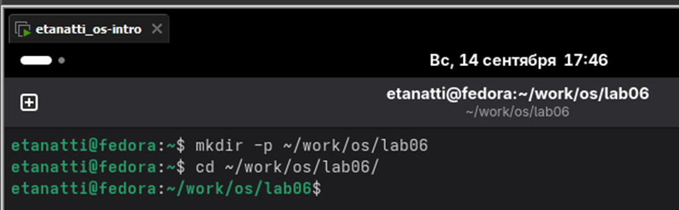

## 3. Вызовите vi и создайте файл hello.sh
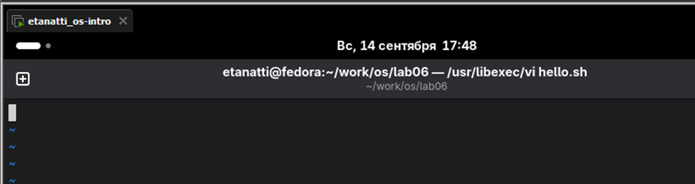

## 4. Нажмите клавишу i и вводите следующий текст
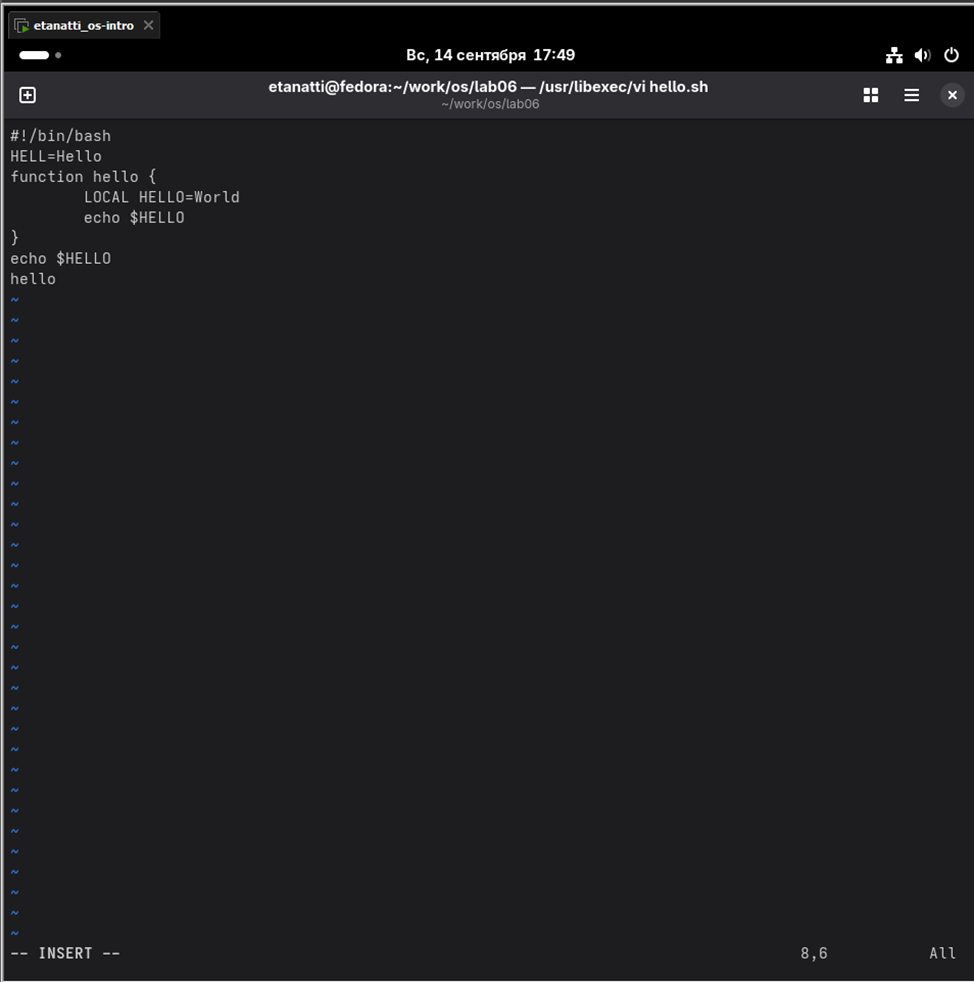

## 5. Нажмите клавишу Esc для перехода в командный режим после завершения ввода текста
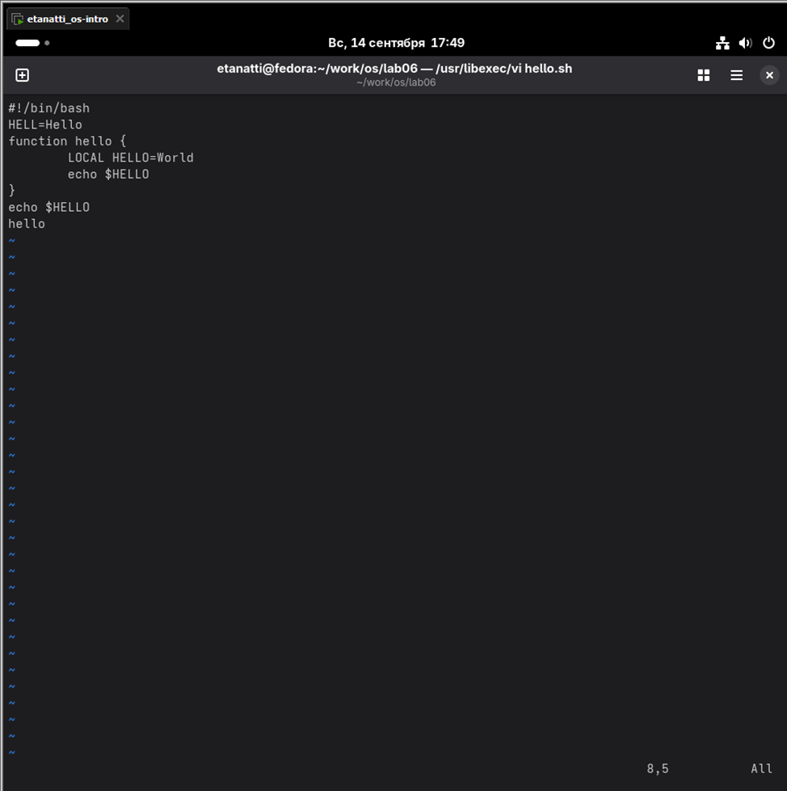

## 6. Нажмите : для перехода в режим последней строки и внизу вашего экрана появится приглашение в виде двоеточия
## 7. Нажмите w (записать) и q (выйти), а затем нажмите клавишу Enter для сохранения вашего текста и завершения работы

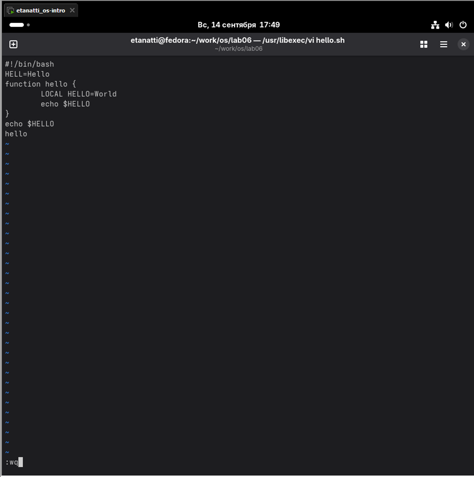

## 8. Сделайте файл исполняемым
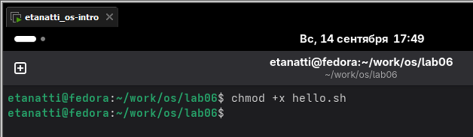

## 8.3.2 Задание 2. Редактирование существующего файла
## 1. Вызовите vi на редактирование файла
## 2. Установите курсор в конец слова HELL второй строки

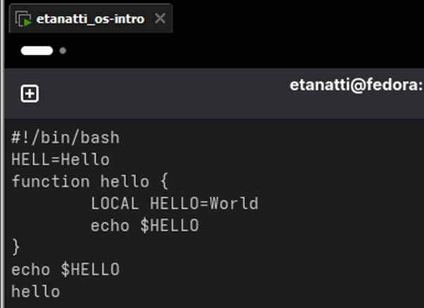

## 3. Перейдите в режим вставки и замените на HELLO. Нажмите Esc для возврата в командный режим
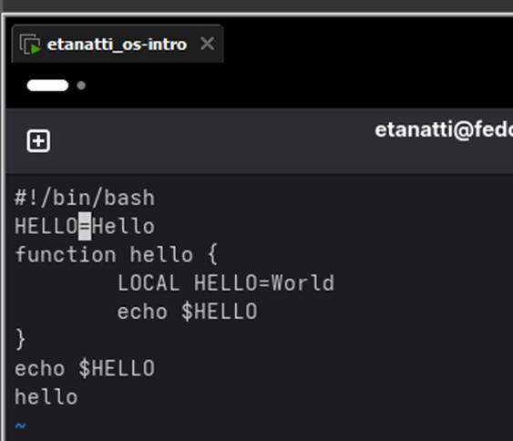

## 4. Установите курсор на четвертую строку и сотрите слово LOCAL
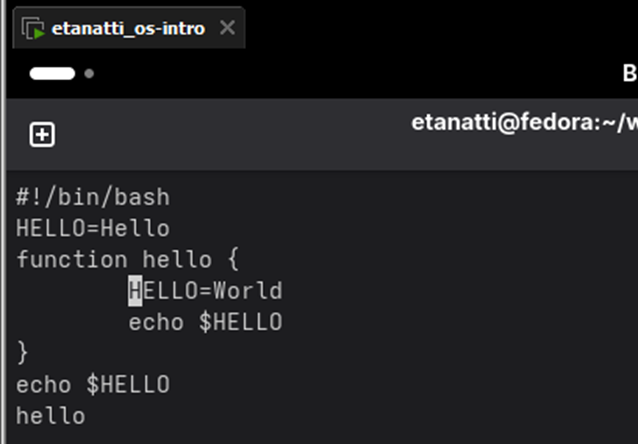

## 5. Перейдите в режим вставки и наберите следующий текст: local, нажмите Esc для возврата в командный режим
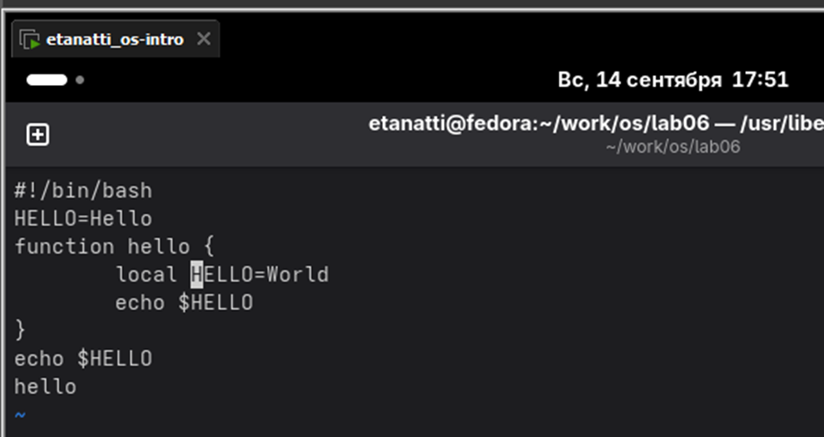

## 6. Установите курсор на последней строке файла. Вставьте после неё строку, содержащую следующий текст: echo $HELLO
## 7. Нажмите Esc для перехода в командный режим
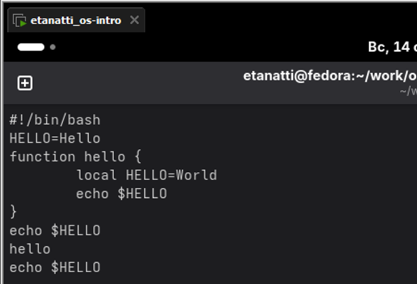

## 8. Удалите последнюю строку
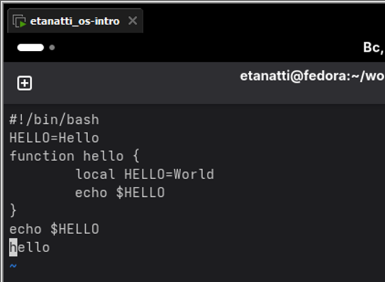

## 9. Введите команду отмены изменений u для отмены последней команды
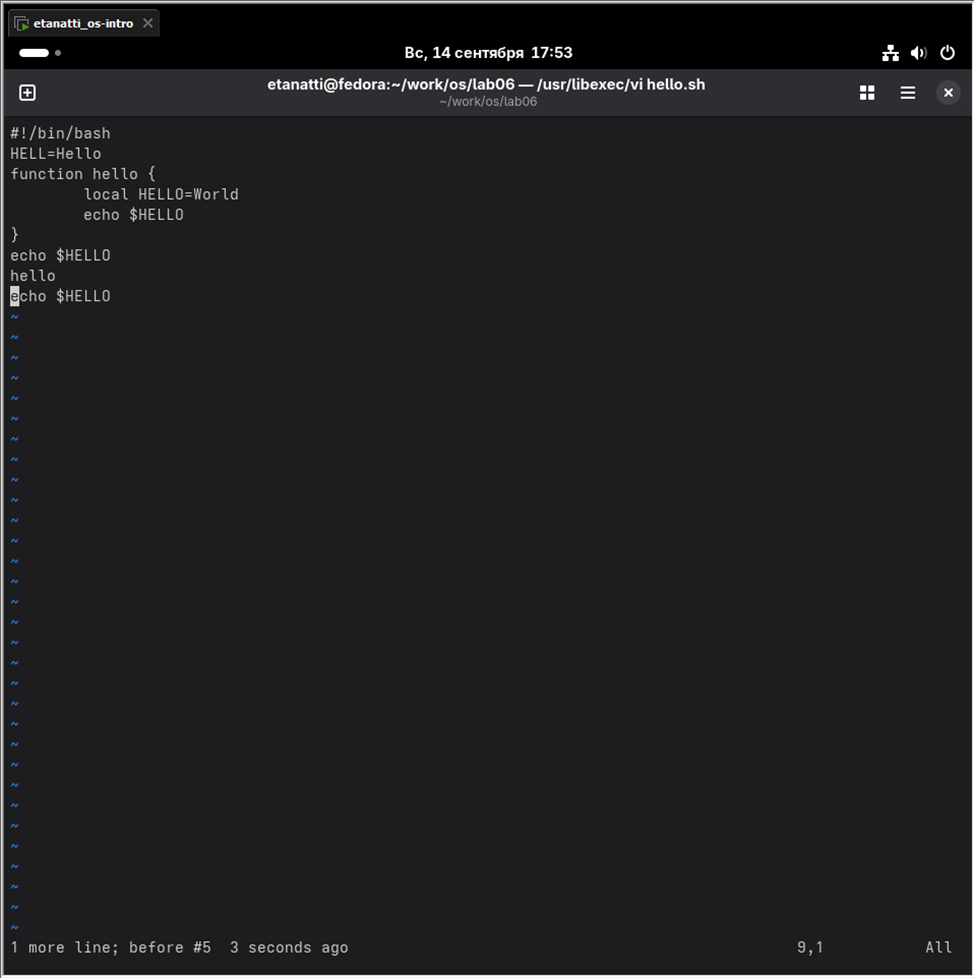

## 10. Введите символ : для перехода в режим последней строки. Запишите произведённые изменения и выйдите из vi
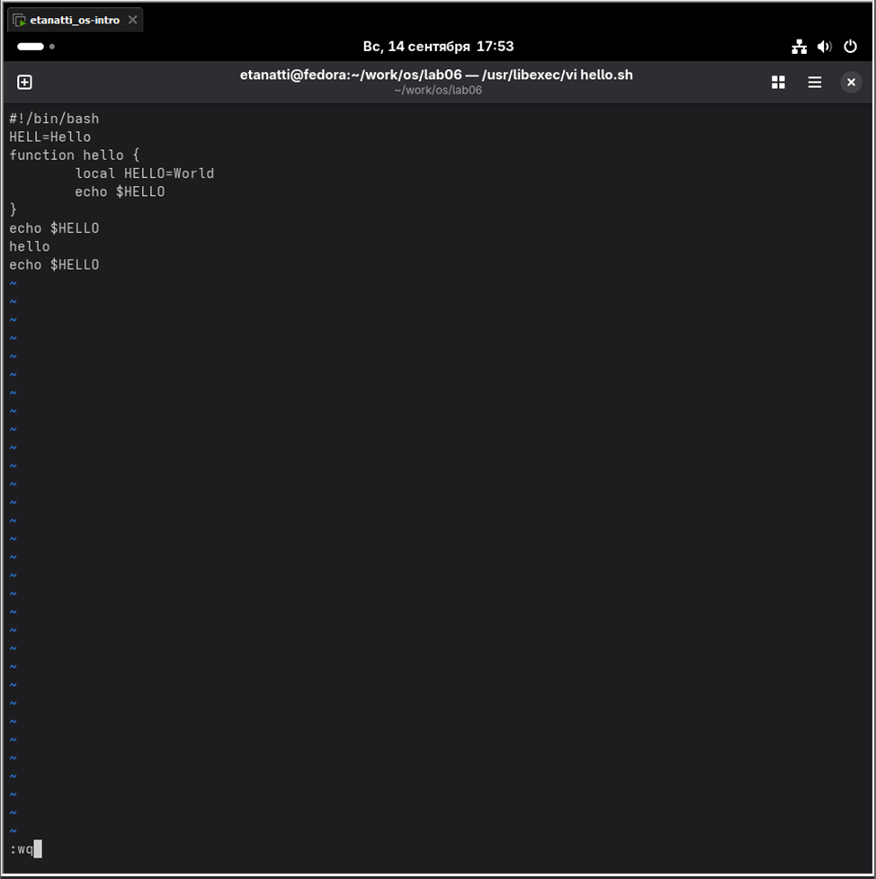

# Контрольные вопросы

### 1. Дайте краткую характеристику режимам работы редактора vi.

- Командный — для навигации и вызова команд (клавиши воспринимаются как команды).
- Вставки — для ввода текста (клавиши воспринимаются как текст).
- Последней строки (ex) — для ввода сложных команд (запускается символом :).

### 2. Как выйти из редактора, не сохраняя произведённые изменения?

Из командного режима набрать :q! и нажать Enter.

### 3. Назовите и дайте краткую характеристику командам позиционирования.

- h, j, k, l — перемещение на один символ влево, вниз, вверх, вправо.
- w / b — на начало следующего / предыдущего слова.
- 0 / $ — в начало / конец текущей строки.
- G — в конец файла.

### 4. Что для редактора vi является словом?

Последовательность букв, цифр и знаков подчеркивания (A-Za-z0-9_) ИЛИ любая последовательность не-пробельных символов (зависит от контекста команды).

### 5. Каким образом из любого места редактируемого файла перейти в начало (конец) файла?

- В начало: 1G или gg
- В конец: G

### 6. Назовите и дайте краткую характеристику основным группам команд редактирования.

- Вставка: i, a — перед/после курсора, o — новую строку.
- Удаление: x (символ), dw (слово), dd (строка).
- Копирование (yank): yw (слово), yy (строка).
- Вставка (paste): p.

### 7. Необходимо заполнить строку символами $. Каковы ваши действия?

Перейти в командный режим, позиционироваться на строку и набрать 100i$Esc (вставить 100 символов $).

### 8. Как отменить некорректное действие, связанное с процессом редактирования?

Из командного режима нажать u (отменить последнее действие).

### 9. Назовите и дайте характеристику основным группам команд режима последней строки.

- Файлы: :w (записать), :q (выйти).
- Поиск: :/текст (вперед), :?текст (назад).
- Замена: :s/старый/новый/ (в текущей строке).

### 10. Как определить, не перемещая курсора, позицию, в которой заканчивается строка?

Нажать g + Ctrl + g (в статусной строке покажет номер строки и позицию).

### 11. Выполните анализ опций редактора vi (сколько их, как узнать их назначение и т.д.).

Опции задаются командой :set. Назначение смотри в справке :help option-list или :help 'optionname' (например, :help 'number').

### 12. Как определить режим работы редактора vi?

Посмотреть на нижний левый угол экрана:
- Пусто — командный режим.
- -- ВСТАВКА -- — режим вставки.
- : — режим последней строки.

### 13. Постройте граф взаимосвязи режимов работы редактора vi.

      [Командный режим] <--- Esc ---
          |     ^
          i, a  |
          |     | (Любая команда редактирования)
          v     |
      [Режим вставки] --- Esc ---->|
          |                        |
          | (Нажать :)             |
          v                        |
      [Режим последней строки] - Enter ->|
